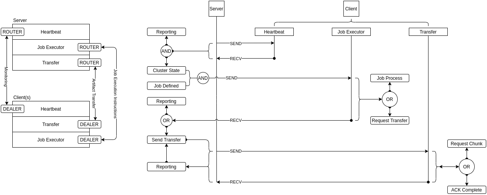

# Directord Components

* TOC
{:toc}

Directord is a single application which consists of three parts:

* **Server** - The server is the centralized manager of all communication and
  application delivery.

* **Client** - The client is the minimal application required for enrolling a
  node into a given cluster.

* **User** - CLI utility which interfaces with the server over a local socket
  connect.


### Cluster Messaging

The cluster messaging uses a router format which ensures it has bi-directional
communication to and from the nodes. The router allows us to create a low
latency mesh which monitors node health and ensures is highly responsive
instruction delivery network.



The application flow has been built to best enable asynchronous operations,
easily scaling to hundreds of clients without impacting throughput. While the
User is expected to interact with the system via CLI, Directord does provide
bindings for programable interfaces.

> The following diagram shows the application flow when using the ZMQ
  messaging driver. While some items in this diagram may be ZMQ specific,
  the general process will remain the same no matter the active messaging
  driver.


### Data storage and persistance

Directord has two modes of operation for data-storage and persistence.

* Ephemeral mode, only retain cluster and job information so long as the server
  process is running.

* Persistent mode, datastore using external datastore; supported datastores
  are: Redis and File. The datastore option available in both config, or on the
  CLI and uses a standard RFC-1738 compatible string. This allows operators to
  connect to different storage backends to suit their environment needs.

> Storing information persistently introduces a dependency on an external system
  and creates latency. While the latency should be minimal, and have nearly no
  impact on task execution, it is something that needs to be considered when
  constructing the cluster topology. Inversely, using an external datastore will
  lower the memory utilization of Directord and can have a profound effect on
  deployment node requirements; this is especially true at hyper-scale.

> The `datastore` option has three potential drivers, **memory**, **file**,
  or **redis**.

> If the datastore option is set to **memory**, the server will spawn a manager
  thread to facilitate the document store.

#### Profiling

Every Directord task is profiled. The execution and the round trip time are
stored and made available when inspecting jobs. This builtin profiling allows
operators to better understand their deployment workloads.

* ROUNDTRIP_TIME: Time taken from task transmit to return. The server will
  timestamp every task when spawned, and will store the delta when the return data
  is received by the server.

* EXECUTION_TIME: Time taken to run a particular task. The client will timestamp
  every task before execution and return the delta once the task exits.

To further understand deployment characteristics, Directord also provides an
*analyze* function which will allow operators do dig deeper into their data.
The job and parent analyze functions will highlight outliers, node discrepancies,
failures, and performance for entire orchestrations.

### Comparative Analysis

Because Directord is task driven and messaging backed it is fast, Directords time
to work is measured in microseconds with return trip times measured in
milliseconds.

To test interactions we used comparison files from the tools directord to run 1000
tasks across a small 6 node test environment.

#### Directord

> The statistics recorded here were provide by the Directord application.
  Execution time and roundtrip time are recorded as part of regular job
  interactions.

The directord cluster was bootstrapped with the
[Native Bootstrap](installation.md#bootstrap-natively) process. Before running
these tests the bootstrap process had to be completed ahead of time. The example
development bootstrap process took **81.23** seconds (1.5 minutes) to complete.

* Run the Directord orchestration command to execute 1000 trivial jobs.

``` shell
$ directord orchestrate --ignore-cache tests/comparison-orchestration.yaml
```

Running the comparison orchestration file with a six node test environment
returns an execution time of **19.41** seconds.

The system also saw the following command characteristics. Each message had the
following average profile.

| EXECUTION_TIME       | ROUNDTRIP_TIME          |
| -------------------- | ----------------------- |
| 0.007496356964111328 | 0.01715874671936035     |

Total execution time, including bootstrapping the environment, took **100.64**
seconds (1.68 minutes).

#### Ansible

Ansible installation was performed in a virtual environment using Ansible
version 3.2.x and Ansible-Base version 2.10.X.

> The statistics recorded here were provide by the Ansible profile callback.

Export environment variables to pull and profile all tasks.

``` shell
$ export PROFILE_TASKS_SORT_ORDER=none
$ export PROFILE_TASKS_TASK_OUTPUT_LIMIT=all
$ export ANSIBLE_CONFIG=tools/ansible.cfg
```

* Run the Ansible playbook command to loop over all 1000 trivial tasks.

``` shell
$ ansible-playbook -i tools/ansible-inventory.yaml tests/comparison-loop-playbook.yml
```

This command runs one shell task with 1000 items within a loop.

| EXECUTION_TIME       |
| -------------------- |
| 1947.63              |

Running the comparison loop playbook with a six node test environment
returns an execution time of **1947** seconds (32 minutes).

* Run the Ansible playbook command to execute 1000 trivial tasks.

``` shell
$ ansible-playbook -i tools/ansible-inventory.yaml tests/comparison-task-playbook.yml
```

This command runs 1000 shell tasks.

| ROUNDTRIP_TIME          |
| ----------------------- |
| 1.793                   |

Running the comparison task playbook with a six node test environment
returns an execution time of **1811.089** seconds (30 minutes).

* Run the Ansible playbook command to execute 1000 trivial tasks with pipelining enabled.

To enable pipelining the export `ANSIBLE_PIPELINING` was set **True**.

``` shell
$ export ANSIBLE_PIPELINING=True
$ ansible-playbook -i tools/ansible-inventory.yaml tests/comparison-task-playbook.yml
```

This command runs 1000 shell tasks.

| ROUNDTRIP_TIME          |
| ----------------------- |
| 0.941                   |

Running the comparison task playbook with a six node test environment
returns an execution time of **963.739** seconds (17 minutes).
